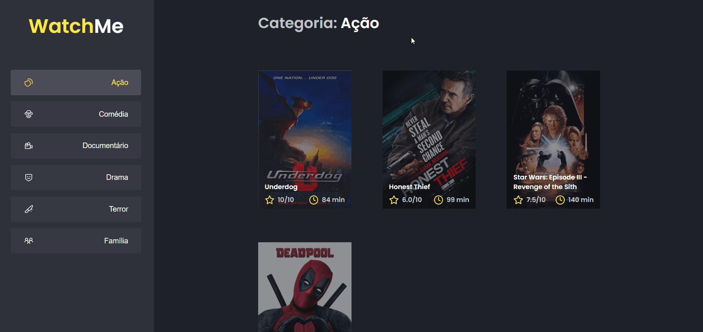

## 🚀 WatchMe

O objetivo é criar uma pequena aplicação onde lista os filmes por categoria, para treinar mais sobre "useEffect, UseState e Axios com fake API com JSON Serve".

## 🎥 Projeto

<div align="center">
  
</div>

## 🧰 Tecnologias e Bibliotecas

- [ReactJS](https://pt-br.reactjs.org/tutorial/tutorial.html)
  - [Sass](https://sass-lang.com/)
  - [Axios](https://www.npmjs.com/package/axios)
- [TypeScript](https://www.typescriptlang.org/)

### Tools para criar API Fake

- [JSON Server](https://www.npmjs.com/package/json-server)

## ⚙️ Rodando o Projeto

```bash
# Clone este repositório para a pasta anterior
$ git clone https://github.com/diogomfc/ignite-challends-WatchMe.git
# ou use a opção de download.

# Acesse a pasta dtmoney
$ cd ignite-challends-WatchMe

# Instale as dependências
$ yarn install
ou
$ npm install

# Executando o server
$ yarn server
ou
$ npm server

# Executando o Projeto
$ yarn start
ou
$ npm start

# Acesse http://localhost:3000 no seu navagador
```

<div align="center">
  <small>Diogo Silva - 2021</small>
</div>
